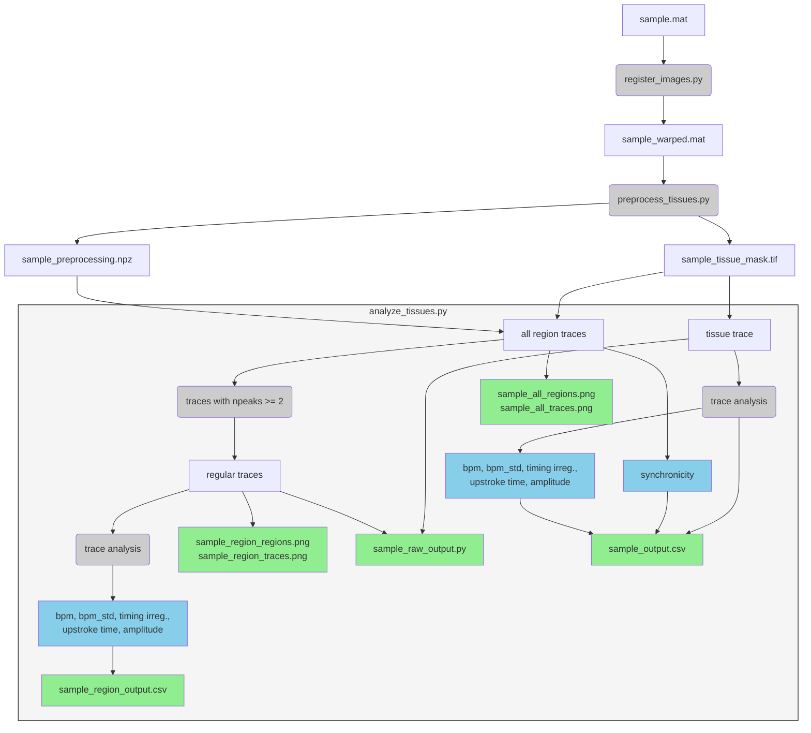

# CALCIUM-IMAGING
Calcium imaging analyzer

# Installation
1. Create an environment and activate it. If using conda, 
```
conda create -n ca-env python=3.13.2
conda activate ca-env
```
If using .venv,
```
python -m venv .venv
source .venv/bin/activate
```
In VScode you can select the environment by using `Ctrl+Shift+P`, type Python Select Interpreter and selecting `./venv/bin/python`.

2. Install necessary packages and modules,
```
python -m pip install -e .
```

# Usage
The code has three main scripts:
1. Registration `register_images.py`
2. Preprocessing `preprocess_tissues.py`
3. Calcium Analysis `analyze_tissues.py`

**You need to run these in order**. For each one of these you will select a folder containing image stacks to be analyzed (`.mat`, `.tif`/`.tiff`, `.nd2`, or `.czi`). 

# Outputs
Below is a diagram of the inputs, codes, and outputs used in this repository.

